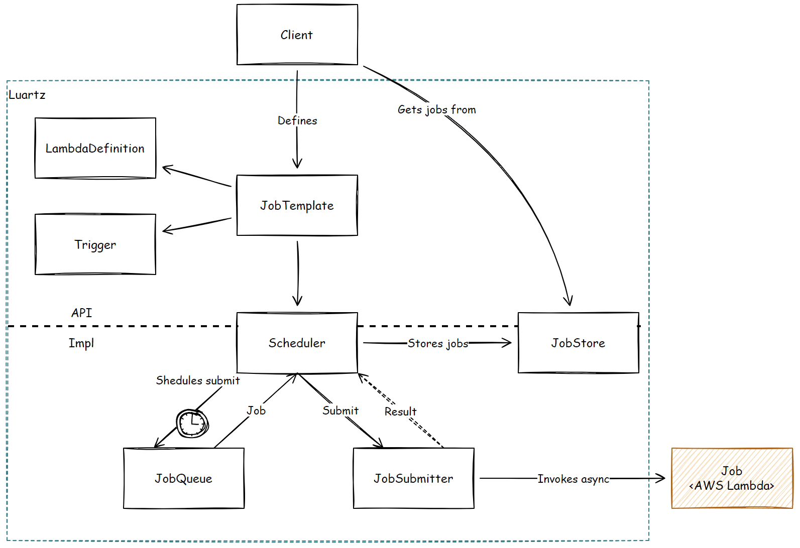
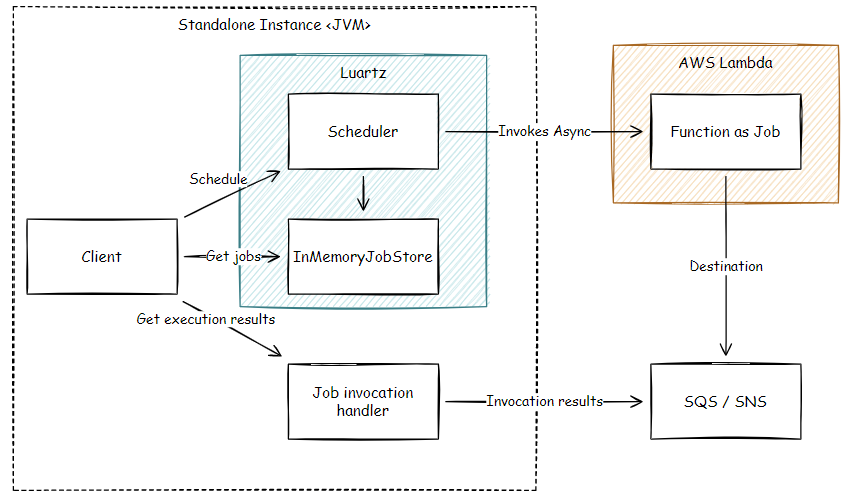

# Luartz - Lambda Job Scheduler

Quartz-like job scheduler based on AWS Lambda

[](https://github.com/zatsepinvl/lambda-job-scheduler/actions/workflows/build.yml)

🚀 Project Status: Proof of Concept development 🚀

## Feature Coverage

| Feature                                  | Status            |
|------------------------------------------|-------------------|
| Submitting job                           | ✅ Implemented     |
| Scheduling one-off job                   | ✅ Implemented     |
| Scheduling recurring job                 | ✅ Implemented     |
| Scheduling cron job                      | ✅ Implemented     |
| Unscheduling job                         | ✅ Implemented     |
| Accessing job details in lambda function | ✅ Implemented     |
| Getting jobs statuses                    | ✅ Implemented     |
| Getting job schedules                    | ✅ Implemented     |
| Lambda automatic deployment              | ✅ Implemented     |
| Listening for job status changes         | 🏃 Coming soon... |
| AWS Lambda throttling handling           | 🤔 Sometime       |
| Misfire handling                         | 🤔 Sometime       |
| Job persistent store                     | 🤔 Sometime       |

## Getting Started

Add dependency:

```groovy
dependencies {
    ...
    implementation "org.laurtz:luartz:1.0.0"
}
```

Create Scheduler instance:

```kotlin
val scheduler = SchedulerFabric.createDefault()
```

Create a trigger:

```kotlin
val trigger = IntervalTrigger(...) 
```
Create a job template:

```kotlin
val jobTemplate = JobTempalte(jobName = "MyJob", trigger = trigger, ...)
```

Schedule a job:

```kotlin
sheudler.schedule(jobTemplate)
```

Get jobs statuses by name:

```kotlin
val store = scheduler.getJobStore()
val jobs = store.getJobsByName("MyJob")
```

## Example App

### Pre-requisites
1. Java 11
2. Gradle
3. Docker and docker-compose

In order to start example app follow the steps:

Start localstack:
```shell
docker-compose up -d localstack
```

Deploy sample lambda:
```shell
./gradlew -p luartz-sample-lambda deploy
```

Start sample app:
```shell
./gradlew -p luartz-sample-app bootRun
```

If you are using Spring Boot run configuration in IntelliJ IDEA or similar, enable env file:


See [luartz-sample-app](luartz-sample-app/src/main/kotlin/org/luartz/app/LuartzSampleApp.kt) for a complete example app.


## Concepts
* **Scheduler** - primary orchestrator component responsible for scheduling and submitting jobs from provided _JobTemplates_.
* **Job** - data class describing a single job execution.
* **JobTemplate** - template to create a job from.
* **JobStore** - repository for created/running/executed jobs.
* **Trigger** - a component that determines the schedule upon which a given Job will be performed.
* **FunctionDefinition** - data class for defining required data to deploy and invoke a particular AWS Lambda function.

### Logical Architecture


### Physical Architecture
